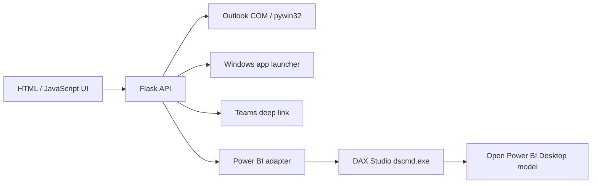

# WorkMate AI

> A local-first work assistant built with **Python + Flask** that connects Outlook, Microsoft Office, Teams and Power BI Desktop in one interactive dashboard.


## Why I built it

A typical workday often starts with the same repetitive steps: checking email, identifying priorities, opening tools, switching between applications and searching for KPIs.

**WorkMate AI** brings those actions into a single local web interface.

The project started as a learning exercise in Python and gradually evolved into a practical automation tool focused on real office workflows.

## Features

- **Morning Brief for Outlook**
  - reads recent messages from Outlook Desktop
  - highlights unread and potentially important emails
  - creates a quick morning summary
- **Email composer**
  - prepares Outlook drafts
  - can send messages directly when explicitly requested
- **Office launcher**
  - opens Outlook, Excel, Word, PowerPoint, Teams and Power BI
- **Teams messaging**
  - opens a Teams chat with recipient and message pre-filled
  - optional local keyboard automation for confirmation
- **Power BI Desktop integration**
  - connects to an open `.pbix` model through **DAX Studio `dscmd.exe`**
  - scans tables, columns and measures
  - executes DAX queries against the local semantic model
  - maps natural-language-like questions to existing measures and fields
- **Interactive assistant**
  - accepts simple natural-language commands
  - fuzzy matching with `RapidFuzz` makes commands tolerant to small typos
- **Local dashboard**
  - Flask backend
  - responsive HTML/CSS/JavaScript interface
  - browser notifications and alert cards

## Screenshots

The local application includes dedicated views for:

- Home / Morning Brief
- Outlook email review and composer
- Office and Teams tools
- Power BI model exploration and DAX queries
- Interactive assistant

Real company data and mailbox contents are intentionally excluded from the public repository.

## Architecture



## Power BI integration

The Power BI integration is the most interesting part of the project.

WorkMate connects to an **already-open Power BI Desktop report** using DAX Studio's command-line utility. It can inspect the model and retrieve:

- tables
- columns
- measures
- measure expressions

The assistant then tries to reuse **existing DAX measures first**, instead of inventing business logic.

Example questions:

```text
How many pending items are there?
What is the completion percentage?
Show activities by area
Show the available measures
```

For advanced use, the UI also includes a manual DAX query panel.

## Tech stack

- Python
- Flask
- HTML / CSS / JavaScript
- pywin32
- RapidFuzz
- pandas
- openpyxl
- PyAutoGUI
- DAX / Power BI Desktop
- DAX Studio CLI (`dscmd.exe`)

## Requirements

- Windows 10/11
- Python 3.11+
- Outlook Desktop for Outlook COM features
- Power BI Desktop for Power BI features
- DAX Studio installed or portable for semantic-model access

Individual integrations can be unavailable without preventing the rest of the dashboard from running.

## Installation

Clone the repository:

```bash
git clone https://github.com/AndreaJoeleMontone/workmate-ai.git
cd workmate-ai
```

Create your local configuration:

```powershell
Copy-Item .\config.example.json .\config.json
```

Install dependencies:

```powershell
py -3 -m pip install -r requirements.txt
```

Run:

```powershell
py -3 app.py
```

Open:

```text
http://127.0.0.1:8765
```

You can also use:

```text
INSTALLA.bat
AVVIA_WORKMATE.bat
```

## Power BI setup

1. Open the target `.pbix` file in Power BI Desktop.
2. Make sure DAX Studio or its portable version is available.
3. Set the report name in `config.json`.
4. Start WorkMate.
5. Open **Power BI**.
6. Click **Connect** and then **Scan model**.
7. Ask questions or run DAX manually.

Example:

```json
"powerbi_desktop": {
  "report_name": "YourReport"
}
```

## Privacy

This project is designed to run locally.

The public repository intentionally does **not** include:

- real email content
- company data
- Power BI business values
- credentials or tokens
- private file paths
- internal screenshots without redaction

Before publishing your own fork, review `config.json`, screenshots and logs carefully.

## Roadmap

- calendar / meeting summary
- scheduled morning brief
- richer multi-step command execution
- configurable LLM/NLP provider
- safer Teams automation
- reusable Power BI semantic aliases
- packaged Windows executable

## Disclaimer

This is an independent personal project and is not affiliated with Microsoft.

Microsoft, Outlook, Teams, Power BI, Excel, Word and PowerPoint are trademarks of their respective owners.
